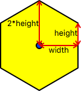

# hexutil
Classes and functions to deal with hexagonal grids.

## Introduction

This module provides the following functionality.

1. Manipulation of grid coordinates in a hexagonal grid.
2. Converting between hexagonal grid coordinates and screen coordinates.
3. Field-of-view calculation on a hexagonal grid.
4. A\* path-finding on a hexagonal grid.

All this is provided by the module `hexutil`.
The file [example.py](example.py) contains example coding using this functionality.
The above image is a screenshot from this example.

## Manipulation of grid coordinates in a hexagonal grid.

The class `hexagon.Hex` represents a particular hexagon in a grid.
Class `Hex` takes two integer arguments, `x` and `y`. 
These need to satisfy the property that their sum is even.

The following (x,y) coordinate system is used to address hexagons in the grid.

At first, it may seem weird that this coordinate system leaves "holes" in the representation, 
i.e. there is no hexagon corresponding to, say,  (0, 1). However, that turns out to be not a real problem in practise.
The advantage is that relationship to the actual center points of the hexagons becomes very simple, namely, just
multiply `y` with √3. This also simplifies screen coordinate calculations.

The only time the "holes" are an issue is if you want to pack grid data densely into a 2D (numpy) array or a list-of-lists. In that case, just use 
`ar[hexagon.x//2][hexagon.y]` to index into array `ar`.

The constructor of `Hex` checks the "x+y is even" property. If it is not satisfied, an `InvalidHex` exception is thrown.

## Converting between hexagonal grid coordinates and screen coordinates.

The mapping of a hexagon to screen (pixel) coordinates can be described by two parameters `width` and `height`.
The following image shows how these relate to the hexagon size.

For a perfectly regular hexagon, the relationship `height = ⅓√3 width` should hold. In practice, we typically want integral pixel coordinates.

The class `HexGrid` captures such a pair of `width` and `height` values. It can be initialized as `HexGrid(width, height)`
or `HexGrid(width)`. In the latter case, `height` is automatically computed as `round(⅓√3 * width)`.

## Field-of-view calculation on a hexagonal grid.

Todo.

## A\* path-finding on a hexagonal grid.

Todo.

